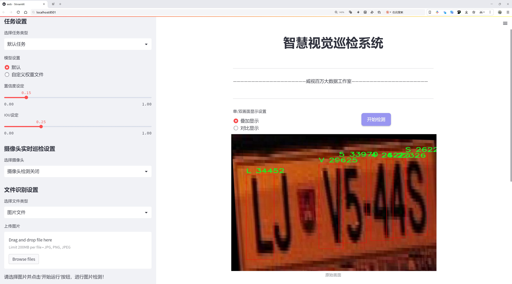
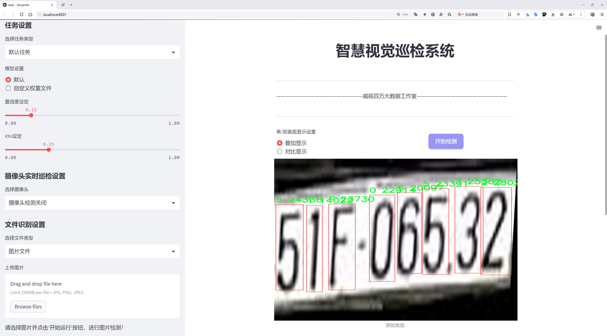
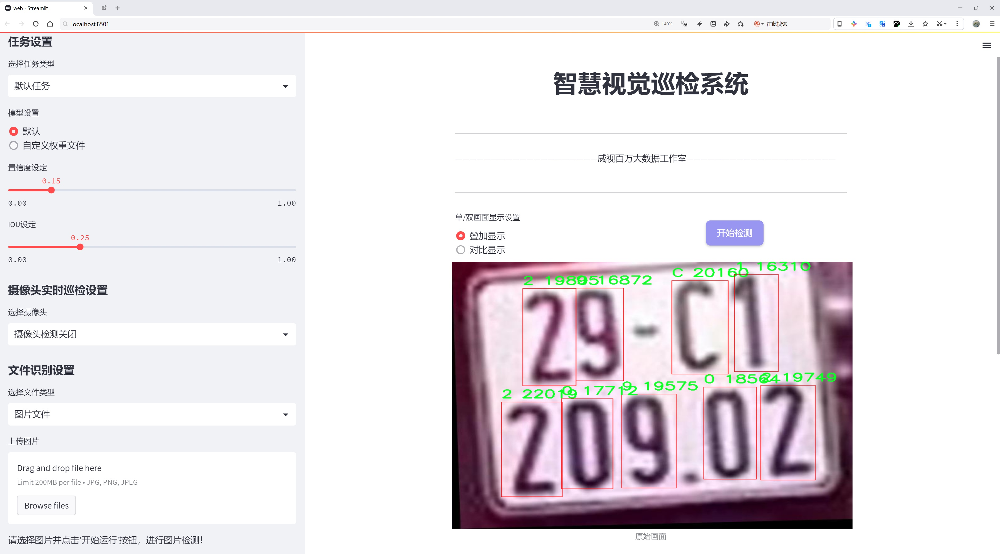
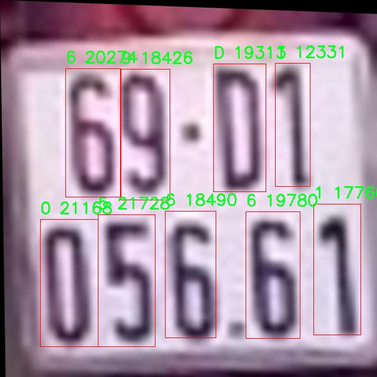
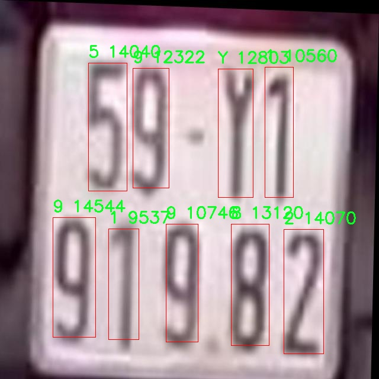
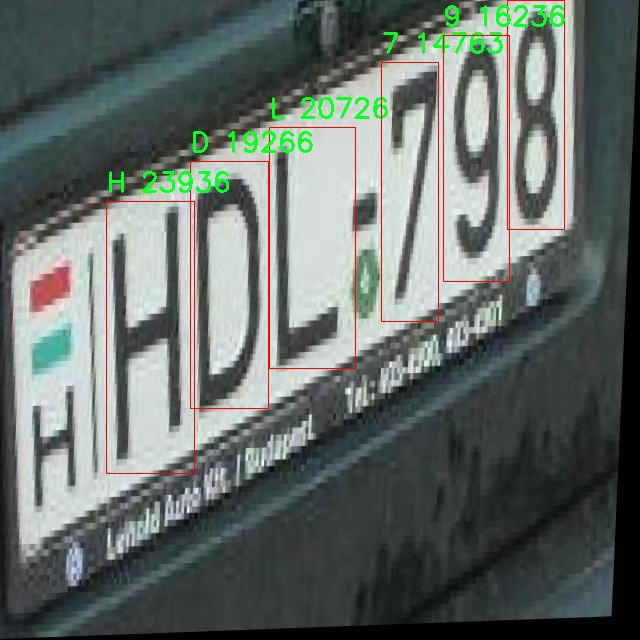
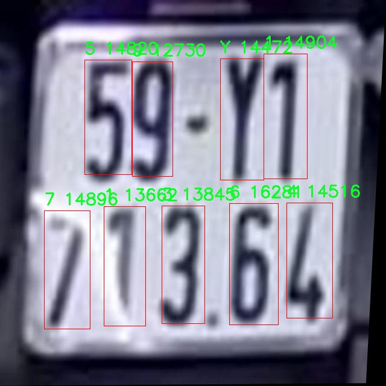
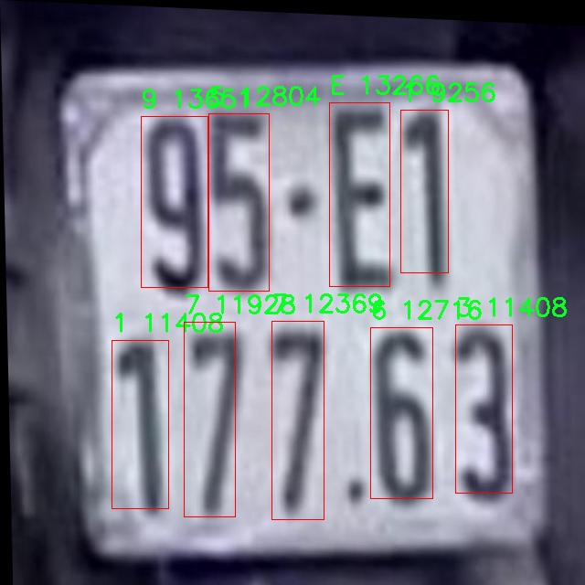

# 外国车牌字符识别与分类检测系统源码分享
 # [一条龙教学YOLOV8标注好的数据集一键训练_70+全套改进创新点发刊_Web前端展示]

### 1.研究背景与意义

项目参考[AAAI Association for the Advancement of Artificial Intelligence](https://gitee.com/qunshansj/projects)

项目来源[AACV Association for the Advancement of Computer Vision](https://gitee.com/qunmasj/projects)

研究背景与意义

随着全球化进程的加快，国际间的交通往来越发频繁，跨国运输和旅游活动日益增多。在这一背景下，车辆识别技术，尤其是车牌识别技术，成为了交通管理、安防监控及智能交通系统中的重要组成部分。车牌作为车辆的身份标识，其信息的准确识别和分类对于提高交通管理效率、保障公共安全具有重要意义。然而，传统的车牌识别方法在处理不同国家和地区的车牌时，往往面临字符多样性、背景复杂性以及光照变化等挑战。因此，基于深度学习的车牌字符识别与分类系统应运而生，并逐渐成为研究的热点。

YOLO（You Only Look Once）系列模型以其高效的实时目标检测能力，广泛应用于各类视觉识别任务。YOLOv8作为该系列的最新版本，凭借其改进的网络结构和优化的算法，展现出更高的检测精度和速度，适合于复杂场景下的车牌识别任务。通过对YOLOv8进行改进，可以更好地适应不同国家车牌的字符识别需求，尤其是在处理包含字母和数字的混合字符时，能够有效提升识别的准确性和鲁棒性。

本研究所使用的数据集“daeiarcwe_abc_123_ver2”包含3800张图像，涵盖30个类别的字符，包括数字0-9和字母A-Z。该数据集的多样性为模型的训练提供了丰富的样本，有助于提高模型在不同场景下的泛化能力。通过对该数据集的深入分析与处理，可以更好地理解不同字符在车牌识别中的特征表现，为后续的模型优化提供理论依据。

在技术层面，改进YOLOv8的外国车牌字符识别与分类系统不仅能够提升识别的准确率，还能够在实时性上满足实际应用需求。这一系统的成功构建，将为智能交通系统的实现提供强有力的技术支持，有助于推动交通管理的智能化进程。此外，该研究还将为相关领域的研究者提供参考，促进车牌识别技术的进一步发展。

从社会意义上看，随着车牌识别技术的普及，交通管理的智能化将有助于减少交通事故、提高道路通行效率，并在公共安全领域发挥重要作用。尤其是在城市交通拥堵和安全隐患日益突出的背景下，基于改进YOLOv8的车牌识别系统将为构建更安全、更高效的交通环境提供新的解决方案。

综上所述，基于改进YOLOv8的外国车牌字符识别与分类系统的研究，不仅具有重要的学术价值和技术意义，也为社会的可持续发展提供了新的思路与方法。通过深入探索这一领域，我们期望能够推动车牌识别技术的进步，为未来的智能交通系统奠定坚实的基础。

### 2.图片演示







##### 注意：由于此博客编辑较早，上面“2.图片演示”和“3.视频演示”展示的系统图片或者视频可能为老版本，新版本在老版本的基础上升级如下：（实际效果以升级的新版本为准）

  （1）适配了YOLOV8的“目标检测”模型和“实例分割”模型，通过加载相应的权重（.pt）文件即可自适应加载模型。

  （2）支持“图片识别”、“视频识别”、“摄像头实时识别”三种识别模式。

  （3）支持“图片识别”、“视频识别”、“摄像头实时识别”三种识别结果保存导出，解决手动导出（容易卡顿出现爆内存）存在的问题，识别完自动保存结果并导出到tempDir中。

  （4）支持Web前端系统中的标题、背景图等自定义修改，后面提供修改教程。

  另外本项目提供训练的数据集和训练教程,暂不提供权重文件（best.pt）,需要您按照教程进行训练后实现图片演示和Web前端界面演示的效果。

### 3.视频演示

[3.1 视频演示](https://www.bilibili.com/video/BV1XCtFeDE2d/)

### 4.数据集信息展示

##### 4.1 本项目数据集详细数据（类别数＆类别名）

nc: 30
names: ['0', '1', '2', '3', '4', '5', '6', '7', '8', '9', 'A', 'B', 'C', 'D', 'E', 'F', 'G', 'H', 'K', 'L', 'M', 'N', 'P', 'S', 'T', 'U', 'V', 'X', 'Y', 'Z']


##### 4.2 本项目数据集信息介绍

数据集信息展示

在本研究中，我们采用了名为“daeiarcwe_abc_123_ver2”的数据集，以支持对外国车牌字符的识别与分类系统的改进，特别是针对YOLOv8模型的训练。该数据集包含30个类别，涵盖了数字和字母的组合，具体类别包括从数字0到9以及字母A到Z（除了字母J和Q）。这些类别的选择不仅反映了车牌字符的多样性，还确保了系统在处理不同国家和地区的车牌时具备较强的适应性和准确性。

数据集的设计旨在模拟真实世界中车牌的多样性与复杂性。每个字符类别的样本数量经过精心挑选，以确保模型在训练过程中能够获得足够的代表性数据。这种多样性对于提高模型的泛化能力至关重要，尤其是在面对不同字体、颜色和背景的车牌时。通过使用“daeiarcwe_abc_123_ver2”数据集，我们能够有效地训练YOLOv8模型，使其在识别过程中能够更好地处理不同的字符组合和排列方式。

数据集中的字符样本不仅包括标准的车牌字符，还涵盖了各种可能的变体，例如不同的字体、大小和旋转角度。这种设计理念使得模型在实际应用中能够应对各种复杂情况，如车牌在不同光照条件下的识别，或是在不同拍摄角度下的字符辨识。此外，数据集还包含了一些噪声和干扰元素，以模拟现实环境中可能遇到的挑战。这种设计有助于提升模型的鲁棒性，使其在面对不完美的输入时仍能保持较高的识别率。

在数据集的构建过程中，我们注重了样本的多样性和代表性，以确保每个类别的样本数量均衡。这种均衡性对于训练深度学习模型至关重要，因为不均衡的数据集可能导致模型在某些类别上的表现不佳。通过精心挑选和标注样本，我们确保了每个字符类别在数据集中的合理分布，从而提高了模型在实际应用中的准确性和可靠性。

此外，数据集的标注过程也经过严格的审核，以确保每个字符的标注准确无误。这一过程不仅包括人工审核，还结合了自动化工具的辅助，以提高标注的效率和准确性。通过这种方式，我们能够为YOLOv8模型提供高质量的训练数据，从而为后续的字符识别与分类任务奠定坚实的基础。

综上所述，“daeiarcwe_abc_123_ver2”数据集的构建与设计充分考虑了外国车牌字符识别的实际需求，涵盖了丰富的字符类别和多样的样本特征。通过使用这一数据集，我们期望能够显著提升YOLOv8模型在字符识别与分类任务中的表现，为未来的智能交通系统和自动化监控提供更为精准的技术支持。











### 5.全套项目环境部署视频教程（零基础手把手教学）

[5.1 环境部署教程链接（零基础手把手教学）](https://www.ixigua.com/7404473917358506534?logTag=c807d0cbc21c0ef59de5)


[5.2 安装Python虚拟环境创建和依赖库安装视频教程链接（零基础手把手教学）](https://www.ixigua.com/7404474678003106304?logTag=1f1041108cd1f708b01a)

### 6.手把手YOLOV8训练视频教程（零基础小白有手就能学会）

[6.1 手把手YOLOV8训练视频教程（零基础小白有手就能学会）](https://www.ixigua.com/7404477157818401292?logTag=d31a2dfd1983c9668658)

### 7.70+种全套YOLOV8创新点代码加载调参视频教程（一键加载写好的改进模型的配置文件）

[7.1 70+种全套YOLOV8创新点代码加载调参视频教程（一键加载写好的改进模型的配置文件）](https://www.ixigua.com/7404478314661806627?logTag=29066f8288e3f4eea3a4)

### 8.70+种全套YOLOV8创新点原理讲解（非科班也可以轻松写刊发刊，V10版本正在科研待更新）

由于篇幅限制，每个创新点的具体原理讲解就不一一展开，具体见下列网址中的创新点对应子项目的技术原理博客网址【Blog】：


[8.1 70+种全套YOLOV8创新点原理讲解链接](https://gitee.com/qunmasj/good)

### 9.系统功能展示（检测对象为举例，实际内容以本项目数据集为准）

图9.1.系统支持检测结果表格显示

  图9.2.系统支持置信度和IOU阈值手动调节

  图9.3.系统支持自定义加载权重文件best.pt(需要你通过步骤5中训练获得)

  图9.4.系统支持摄像头实时识别

  图9.5.系统支持图片识别

  图9.6.系统支持视频识别

  图9.7.系统支持识别结果文件自动保存

  图9.8.系统支持Excel导出检测结果数据


### 10.原始YOLOV8算法原理

原始YOLOv8算法原理

YOLOv8算法是目标检测领域的一个重要里程碑，其设计理念和实现方法在继承YOLO系列优良传统的基础上，进行了多项创新和优化。该算法不仅在检测精度上有了显著提升，同时在计算效率和模型轻量化方面也表现出色，成为当前最先进的目标检测算法之一。

YOLOv8的核心在于其网络结构的设计。与之前的YOLO版本相比，YOLOv8在骨干网络中继续采用跨级结构（Cross Stage Partial, CSP），但对YOLOv5中的C3模块进行了优化，替换为更加轻量的C2f模块。这一模块的设计将输入特征图分为两个分支，分别经过卷积处理后再进行融合，从而在保持模型复杂度较低的同时，提升了特征提取的能力。通过这种方式，YOLOv8能够更有效地捕捉到图像中的重要特征，进而提高目标检测的准确性。

在特征提取的过程中，YOLOv8依然保留了空间金字塔池化（SPP）模块，利用其多尺度特征提取的优势，进一步增强了模型对不同尺寸目标的检测能力。通过对特征图进行多层次的处理，YOLOv8能够在同一时间内提取到丰富的上下文信息，从而为后续的目标检测提供更为全面的特征基础。此外，YOLOv8在颈部网络中采用了特征金字塔网络（FPN）与路径聚合网络（PAN）的结合，形成了一个高效的特征融合机制，使得不同尺度的特征能够得到有效整合，提升了模型对复杂场景的适应能力。

YOLOv8在检测网络的设计上也做出了重要创新。该算法采用了无锚框（Anchor-Free）检测方式，直接预测目标的中心点及其宽高比例。这一方法的优势在于减少了对锚框的依赖，降低了模型的复杂性，同时提高了检测速度和准确度。通过这种方式，YOLOv8能够更灵活地适应不同场景中的目标形态变化，进一步提升了目标检测的鲁棒性。

在损失函数的设计上，YOLOv8引入了新的损失策略，特别是变焦损失（Focal Loss）用于计算分类损失。这种损失函数的设计旨在解决类别不平衡问题，使得模型在训练过程中更加关注难以分类的样本。此外，YOLOv8还采用了数据平均保真度损失和完美交并比损失来计算边界框损失。这一系列的损失函数设计，使得YOLOv8在目标检测任务中表现出更高的准确性和稳定性。

YOLOv8的这些创新和优化，使得其在实际应用中表现出色，尤其是在复杂场景下的目标检测任务中。算法的高效性和准确性使得其在实时检测、视频监控、自动驾驶等领域得到了广泛应用。随着YOLOv8的推出，目标检测技术的应用场景得到了进一步拓展，为相关领域的研究和实践提供了新的可能性。

总的来说，YOLOv8算法通过对网络结构的优化、特征提取方法的改进以及损失函数的创新，形成了一种高效、准确的目标检测解决方案。其在各个方面的提升，不仅继承了YOLO系列的优良传统，也为未来的目标检测研究指明了方向。随着技术的不断进步，YOLOv8及其后续版本将继续推动目标检测领域的发展，为更多的实际应用提供支持。


### 11.项目核心源码讲解（再也不用担心看不懂代码逻辑）

#### 11.1 70+种YOLOv8算法改进源码大全和调试加载训练教程（非必要）\ultralytics\models\yolo\classify\__init__.py

以下是对给定代码的核心部分进行提炼和详细注释的结果：

```python
# 导入Ultralytics YOLO库中的分类模块
# 该模块用于图像分类任务，包括预测、训练和验证功能

# 从分类预测模块导入ClassificationPredictor类
from ultralytics.models.yolo.classify.predict import ClassificationPredictor

# 从分类训练模块导入ClassificationTrainer类
from ultralytics.models.yolo.classify.train import ClassificationTrainer

# 从分类验证模块导入ClassificationValidator类
from ultralytics.models.yolo.classify.val import ClassificationValidator

# 定义模块的公开接口，包含三个核心类
__all__ = 'ClassificationPredictor', 'ClassificationTrainer', 'ClassificationValidator'
```

### 代码核心部分说明：
1. **导入模块**：
   - 代码导入了三个主要的类，分别用于分类预测、训练和验证。这些类是Ultralytics YOLO库中处理图像分类任务的核心组件。

2. **公开接口**：
   - `__all__` 变量定义了模块的公开接口，表示当使用 `from module import *` 时，只有这些类会被导入。这有助于控制模块的可见性和使用。

### 详细注释：
- `ClassificationPredictor`：用于对图像进行分类预测的类，通常包含加载模型、处理输入数据和输出预测结果的方法。
- `ClassificationTrainer`：用于训练分类模型的类，通常包括数据加载、模型训练过程和保存模型的功能。
- `ClassificationValidator`：用于验证分类模型性能的类，通常包含评估模型在验证集上的准确性和其他指标的方法。

这些核心部分构成了YOLO分类模块的基础，用户可以通过这些类进行图像分类的各个阶段。

这个文件是一个Python模块的初始化文件，主要用于Ultralytics YOLO模型的分类功能。文件的第一行是版权声明，表明该代码遵循AGPL-3.0许可证。

接下来的几行代码导入了三个类：`ClassificationPredictor`、`ClassificationTrainer`和`ClassificationValidator`。这些类分别用于模型的预测、训练和验证。通过导入这些类，用户可以方便地使用它们进行图像分类任务。

最后，`__all__`变量定义了模块的公共接口，列出了可以被外部导入的类名。这意味着当其他模块使用`from ultralytics.models.yolo.classify import *`时，只会导入`ClassificationPredictor`、`ClassificationTrainer`和`ClassificationValidator`这三个类。

总体而言，这个文件的作用是组织和暴露YOLO模型分类相关的功能，使得其他部分的代码能够方便地使用这些功能。

#### 11.2 ui.py

以下是代码中最核心的部分，并附上详细的中文注释：

```python
import sys
import subprocess

def run_script(script_path):
    """
    使用当前 Python 环境运行指定的脚本。

    Args:
        script_path (str): 要运行的脚本路径

    Returns:
        None
    """
    # 获取当前 Python 解释器的路径
    python_path = sys.executable

    # 构建运行命令，使用 streamlit 运行指定的脚本
    command = f'"{python_path}" -m streamlit run "{script_path}"'

    # 执行命令，并等待其完成
    result = subprocess.run(command, shell=True)
    
    # 检查命令执行的返回码，如果不为0则表示出错
    if result.returncode != 0:
        print("脚本运行出错。")

# 实例化并运行应用
if __name__ == "__main__":
    # 指定要运行的脚本路径
    script_path = "web.py"  # 这里可以直接指定脚本名

    # 调用函数运行脚本
    run_script(script_path)
```

### 代码说明：
1. **导入模块**：
   - `sys`：用于获取当前 Python 解释器的路径。
   - `subprocess`：用于执行外部命令。

2. **`run_script` 函数**：
   - 接收一个参数 `script_path`，表示要运行的脚本的路径。
   - 使用 `sys.executable` 获取当前 Python 解释器的路径。
   - 构建一个命令字符串，使用 `streamlit` 模块运行指定的脚本。
   - 使用 `subprocess.run` 执行构建的命令，并等待其完成。
   - 检查命令的返回码，如果返回码不为0，表示脚本运行出错，并打印错误信息。

3. **主程序块**：
   - 在主程序中，指定要运行的脚本路径（此处为 `web.py`）。
   - 调用 `run_script` 函数，执行指定的脚本。

这个程序文件的主要功能是通过当前的 Python 环境来运行一个指定的脚本，具体是一个名为 `web.py` 的文件。程序首先导入了必要的模块，包括 `sys`、`os` 和 `subprocess`，这些模块提供了与系统交互的功能。`abs_path` 函数来自 `QtFusion.path` 模块，用于获取文件的绝对路径。

在 `run_script` 函数中，首先获取当前 Python 解释器的路径，这样可以确保使用正确的 Python 环境来执行脚本。接着，构建一个命令字符串，该命令使用 `streamlit` 模块来运行指定的脚本。`streamlit` 是一个用于构建数据应用的库，命令的格式是 `python -m streamlit run script_path`。

然后，使用 `subprocess.run` 方法执行这个命令。这个方法会在一个新的进程中运行命令，并且可以捕获命令的返回状态。如果脚本运行出现错误（即返回码不为0），程序会打印出“脚本运行出错”的提示。

在文件的最后部分，使用 `if __name__ == "__main__":` 语句来确保只有在直接运行该文件时才会执行下面的代码。这里指定了要运行的脚本路径，即 `web.py`，并调用 `run_script` 函数来执行它。

总体来说，这个程序的作用是方便用户在当前 Python 环境中启动一个 Streamlit 应用，具体的应用逻辑则在 `web.py` 文件中实现。

#### 11.3 code\ultralytics\models\utils\loss.py

以下是经过简化并添加详细中文注释的核心代码部分：

```python
import torch
import torch.nn as nn
import torch.nn.functional as F
from ultralytics.utils.loss import FocalLoss, VarifocalLoss
from ultralytics.utils.metrics import bbox_iou
from .ops import HungarianMatcher

class DETRLoss(nn.Module):
    """
    DETR (DEtection TRansformer) 损失类。该类计算并返回DETR目标检测模型的不同损失组件。
    包括分类损失、边界框损失、GIoU损失和可选的辅助损失。
    """

    def __init__(self, nc=80, loss_gain=None, aux_loss=True, use_fl=True, use_vfl=False):
        """
        初始化DETR损失函数。

        参数:
            nc (int): 类别数量。
            loss_gain (dict): 各种损失组件的系数。
            aux_loss (bool): 是否计算辅助损失。
            use_fl (bool): 是否使用FocalLoss。
            use_vfl (bool): 是否使用VarifocalLoss。
        """
        super().__init__()

        # 设置损失系数
        if loss_gain is None:
            loss_gain = {"class": 1, "bbox": 5, "giou": 2}
        self.nc = nc
        self.loss_gain = loss_gain
        self.aux_loss = aux_loss
        self.fl = FocalLoss() if use_fl else None  # Focal Loss
        self.vfl = VarifocalLoss() if use_vfl else None  # Varifocal Loss
        self.matcher = HungarianMatcher(cost_gain={"class": 2, "bbox": 5, "giou": 2})  # 匹配器

    def _get_loss_class(self, pred_scores, targets, gt_scores, num_gts):
        """计算分类损失。"""
        bs, nq = pred_scores.shape[:2]  # 获取批次大小和查询数量
        one_hot = torch.zeros((bs, nq, self.nc + 1), dtype=torch.int64, device=targets.device)  # 创建one-hot编码
        one_hot.scatter_(2, targets.unsqueeze(-1), 1)  # 填充one-hot编码
        one_hot = one_hot[..., :-1]  # 去掉最后一类

        gt_scores = gt_scores.view(bs, nq, 1) * one_hot  # 计算真实得分

        # 使用Focal Loss或普通的BCE损失
        if self.fl:
            loss_cls = self.vfl(pred_scores, gt_scores, one_hot) if num_gts else self.fl(pred_scores, one_hot.float())
            loss_cls /= max(num_gts, 1) / nq  # 归一化损失
        else:
            loss_cls = nn.BCEWithLogitsLoss(reduction="none")(pred_scores, gt_scores).mean(1).sum()  # 计算BCE损失

        return {"loss_class": loss_cls.squeeze() * self.loss_gain["class"]}  # 返回分类损失

    def _get_loss_bbox(self, pred_bboxes, gt_bboxes):
        """计算边界框损失和GIoU损失。"""
        loss = {}
        if len(gt_bboxes) == 0:  # 如果没有真实边界框
            loss["loss_bbox"] = torch.tensor(0.0, device=self.device)
            loss["loss_giou"] = torch.tensor(0.0, device=self.device)
            return loss

        # 计算L1损失和GIoU损失
        loss["loss_bbox"] = self.loss_gain["bbox"] * F.l1_loss(pred_bboxes, gt_bboxes, reduction="sum") / len(gt_bboxes)
        loss["loss_giou"] = 1.0 - bbox_iou(pred_bboxes, gt_bboxes, xywh=True, GIoU=True)
        loss["loss_giou"] = loss["loss_giou"].sum() / len(gt_bboxes) * self.loss_gain["giou"]
        return {k: v.squeeze() for k, v in loss.items()}  # 返回损失

    def _get_loss(self, pred_bboxes, pred_scores, gt_bboxes, gt_cls, gt_groups):
        """获取总损失。"""
        match_indices = self.matcher(pred_bboxes, pred_scores, gt_bboxes, gt_cls, gt_groups)  # 计算匹配索引
        idx, gt_idx = self._get_index(match_indices)  # 获取索引
        pred_bboxes, gt_bboxes = pred_bboxes[idx], gt_bboxes[gt_idx]  # 获取匹配的边界框

        bs, nq = pred_scores.shape[:2]
        targets = torch.full((bs, nq), self.nc, device=pred_scores.device, dtype=gt_cls.dtype)  # 初始化目标
        targets[idx] = gt_cls[gt_idx]  # 填充目标

        gt_scores = torch.zeros([bs, nq], device=pred_scores.device)  # 初始化真实得分
        if len(gt_bboxes):
            gt_scores[idx] = bbox_iou(pred_bboxes.detach(), gt_bboxes, xywh=True).squeeze(-1)  # 计算IOU

        loss = {}
        loss.update(self._get_loss_class(pred_scores, targets, gt_scores, len(gt_bboxes)))  # 计算分类损失
        loss.update(self._get_loss_bbox(pred_bboxes, gt_bboxes))  # 计算边界框损失
        return loss  # 返回总损失

    def forward(self, pred_bboxes, pred_scores, batch):
        """
        前向传播，计算损失。

        参数:
            pred_bboxes (torch.Tensor): 预测的边界框。
            pred_scores (torch.Tensor): 预测的得分。
            batch (dict): 包含真实信息的字典。

        返回:
            (dict): 包含总损失的字典。
        """
        gt_cls, gt_bboxes, gt_groups = batch["cls"], batch["bboxes"], batch["gt_groups"]  # 获取真实标签
        total_loss = self._get_loss(pred_bboxes[-1], pred_scores[-1], gt_bboxes, gt_cls, gt_groups)  # 计算总损失

        if self.aux_loss:  # 如果需要计算辅助损失
            total_loss.update(self._get_loss_aux(pred_bboxes[:-1], pred_scores[:-1], gt_bboxes, gt_cls, gt_groups))

        return total_loss  # 返回总损失
```

### 代码说明
1. **DETRLoss类**：这是一个用于计算DETR模型损失的类。它包含了分类损失、边界框损失和GIoU损失的计算方法。
2. **初始化方法**：在初始化时设置类别数量、损失系数、是否使用Focal Loss和Varifocal Loss等参数。
3. **损失计算方法**：
   - `_get_loss_class`：计算分类损失。
   - `_get_loss_bbox`：计算边界框损失和GIoU损失。
   - `_get_loss`：综合计算分类损失和边界框损失。
4. **前向传播方法**：接受预测的边界框和得分，以及真实标签，计算并返回总损失。

这个程序文件实现了一个用于目标检测模型的损失计算类，主要是基于DETR（DEtection TRansformer）模型的损失函数。文件中定义了两个类：`DETRLoss`和`RTDETRDetectionLoss`，后者是前者的扩展，专门用于实时深度跟踪（RT-DETR）模型。

`DETRLoss`类负责计算DETR模型的各种损失，包括分类损失、边界框损失、广义IoU（GIoU）损失等。它的构造函数接收多个参数，例如类别数量、损失系数、是否使用辅助损失、是否使用Focal Loss和Varifocal Loss等。类中还定义了一个匈牙利匹配器（HungarianMatcher），用于计算匹配成本和索引。

在`DETRLoss`类中，主要的损失计算方法包括：
- `_get_loss_class`：计算分类损失。它根据预测的分数、目标值和真实分数来计算损失，支持使用Focal Loss或Varifocal Loss。
- `_get_loss_bbox`：计算边界框损失和GIoU损失。它根据预测的边界框和真实边界框计算L1损失和IoU损失。
- `_get_loss_aux`：计算辅助损失，适用于多个解码器层的输出。
- `_get_loss`：综合调用分类损失和边界框损失的计算方法，得到最终的损失值。

`RTDETRDetectionLoss`类扩展了`DETRLoss`，在其基础上增加了对去噪训练损失的计算。它的`forward`方法接收预测的边界框和分数、批量数据以及可选的去噪边界框和分数。若提供了去噪元数据，它会计算去噪损失并将其与总损失合并。

文件中还包含了一些静态方法和辅助函数，例如`_get_index`用于从匹配索引中提取批次索引、源索引和目标索引，`_get_assigned_bboxes`用于根据匹配索引分配预测的边界框和真实边界框。

总体来说，这个文件实现了DETR模型损失计算的核心逻辑，提供了灵活的损失计算方式，以支持不同的训练需求和模型结构。

#### 11.4 code\ultralytics\utils\checks.py

以下是经过简化并注释的核心代码部分，主要集中在版本检查、依赖项解析和环境检查等功能上：

```python
import re
from pathlib import Path
from typing import List, Dict, Optional
from importlib import metadata
import logging

LOGGER = logging.getLogger(__name__)

def parse_requirements(file_path: Path, package: str = "") -> List[Dict[str, str]]:
    """
    解析 requirements.txt 文件，忽略以 '#' 开头的行和 '#' 后的文本。

    Args:
        file_path (Path): requirements.txt 文件的路径。
        package (str, optional): 要使用的 Python 包名。

    Returns:
        List[Dict[str, str]]: 解析后的需求列表，每个需求以字典形式表示，包含 `name` 和 `specifier` 键。
    """
    if package:
        # 获取指定包的依赖
        requires = [x for x in metadata.distribution(package).requires if "extra == " not in x]
    else:
        # 从文件中读取依赖
        requires = Path(file_path).read_text().splitlines()

    requirements = []
    for line in requires:
        line = line.strip()
        if line and not line.startswith("#"):
            line = line.split("#")[0].strip()  # 忽略行内注释
            match = re.match(r"([a-zA-Z0-9-_]+)\s*([<>!=~]+.*)?", line)
            if match:
                requirements.append({
                    'name': match[1],
                    'specifier': match[2].strip() if match[2] else ""
                })

    return requirements


def parse_version(version: str = "0.0.0") -> tuple:
    """
    将版本字符串转换为整数元组，忽略附加的非数字字符串。

    Args:
        version (str): 版本字符串，例如 '2.0.1+cpu'

    Returns:
        tuple: 表示版本数字部分的整数元组，例如 (2, 0, 1)
    """
    try:
        return tuple(map(int, re.findall(r"\d+", version)[:3]))  # 提取前三个数字
    except Exception as e:
        LOGGER.warning(f"解析版本失败，返回 (0, 0, 0): {e}")
        return 0, 0, 0


def check_version(current: str = "0.0.0", required: str = "0.0.0", name: str = "version") -> bool:
    """
    检查当前版本是否满足所需版本或范围。

    Args:
        current (str): 当前版本。
        required (str): 所需版本或范围（以 pip 风格格式）。
        name (str): 用于警告消息的名称。

    Returns:
        bool: 如果满足要求，则返回 True，否则返回 False。
    """
    if not current:
        LOGGER.warning(f"无效的版本检查请求: {current}, {required}")
        return True

    c = parse_version(current)  # 解析当前版本
    for r in required.strip(",").split(","):
        op, version = re.match(r"([^0-9]*)([\d.]+)", r).groups()  # 分离操作符和版本
        v = parse_version(version)  # 解析所需版本
        # 根据操作符进行比较
        if op == "==" and c != v:
            return False
        elif op == "!=" and c == v:
            return False
        elif op in (">=", "") and not (c >= v):
            return False
        elif op == "<=" and not (c <= v):
            return False
        elif op == ">" and not (c > v):
            return False
        elif op == "<" and not (c < v):
            return False
    return True


def check_requirements(requirements: Path, exclude: tuple = (), install: bool = True) -> bool:
    """
    检查已安装的依赖项是否满足要求，并尝试自动更新。

    Args:
        requirements (Path): requirements.txt 文件的路径。
        exclude (tuple): 要排除的包名元组。
        install (bool): 如果为 True，则尝试自动更新不满足要求的包。

    Returns:
        bool: 如果所有要求都满足，则返回 True，否则返回 False。
    """
    # 检查 Python 版本
    check_python()  
    if isinstance(requirements, Path):  # requirements.txt 文件
        file = requirements.resolve()
        assert file.exists(), f"{file} 未找到，检查失败。"
        requirements = [f"{x['name']}{x['specifier']}" for x in parse_requirements(file) if x['name'] not in exclude]
    elif isinstance(requirements, str):
        requirements = [requirements]

    pkgs = []
    for r in requirements:
        name, required = re.match(r"([a-zA-Z0-9-_]+)([<>!=~]+.*)?", r).groups()  # 提取包名和要求
        try:
            assert check_version(metadata.version(name), required)  # 检查版本
        except (AssertionError, metadata.PackageNotFoundError):
            pkgs.append(r)

    if pkgs and install:  # 如果有包不满足要求且需要安装
        # 尝试自动更新
        LOGGER.info(f"尝试自动更新缺失的包: {pkgs}")
        # 这里可以添加自动更新的代码
        return False

    return True


def check_python(minimum: str = "3.8.0") -> bool:
    """
    检查当前 Python 版本是否满足最低要求。

    Args:
        minimum (str): 所需的最低 Python 版本。

    Returns:
        bool: 如果满足要求，则返回 True，否则返回 False。
    """
    return check_version(platform.python_version(), minimum, name="Python ", hard=True)
```

### 代码说明：
1. **`parse_requirements`**: 解析 `requirements.txt` 文件，返回包名和版本要求的列表。
2. **`parse_version`**: 将版本字符串转换为元组，便于进行版本比较。
3. **`check_version`**: 检查当前版本是否满足所需版本或范围。
4. **`check_requirements`**: 检查依赖项是否满足要求，并尝试自动更新。
5. **`check_python`**: 检查当前 Python 版本是否满足最低要求。

以上代码主要用于处理依赖项的解析和版本检查，确保运行环境满足所需条件。

这个程序文件 `checks.py` 是 Ultralytics YOLO 框架的一部分，主要用于检查和验证环境、依赖项和配置，以确保模型的正常运行。文件中包含了多个函数，每个函数的功能各有不同，主要涉及以下几个方面：

首先，文件导入了许多必要的库和模块，包括 `os`、`sys`、`torch`、`cv2` 等，这些库提供了文件操作、系统信息获取、图像处理和深度学习相关的功能。文件还定义了一些常量和工具函数，便于后续的检查和验证。

文件的核心功能是通过一系列函数来解析和检查依赖项、版本、文件路径、图像尺寸等。例如，`parse_requirements` 函数用于解析 `requirements.txt` 文件，提取出需要的包及其版本要求；`check_version` 函数用于检查当前安装的版本是否满足特定的版本要求；`check_imgsz` 函数则用于验证图像尺寸是否符合特定的步幅要求，并进行必要的调整。

此外，文件中还包含了检查 Python 版本、Torch 和 Torchvision 兼容性、检查是否支持图像显示等功能的函数。这些检查确保了用户的环境能够支持 YOLO 模型的运行。例如，`check_python` 函数确保当前 Python 版本不低于指定的最低版本，而 `check_torchvision` 函数则检查 PyTorch 和 Torchvision 的版本是否兼容。

在文件中，`check_requirements` 函数是一个重要的功能，它会检查所需的依赖项是否已安装，并在需要时尝试自动更新。这个函数支持从文件、单个包或多个包中读取依赖项，并可以排除某些包的检查。

文件还提供了一些用于检查文件和路径的函数，如 `check_file` 和 `check_yaml`，这些函数可以在必要时下载缺失的文件，并确保文件的后缀名符合要求。

最后，文件中还包含了一些用于收集系统信息的函数，如 `collect_system_info`，它会输出操作系统、Python 版本、内存、CPU 和 CUDA 的相关信息。这对于调试和优化模型运行环境非常有帮助。

总体而言，`checks.py` 文件通过一系列功能函数，确保了 YOLO 模型在不同环境中的兼容性和稳定性，为用户提供了一个良好的使用体验。

#### 11.5 train.py

以下是经过简化和注释的核心代码部分：

```python
import random
import numpy as np
import torch.nn as nn
from ultralytics.data import build_dataloader, build_yolo_dataset
from ultralytics.engine.trainer import BaseTrainer
from ultralytics.models import yolo
from ultralytics.nn.tasks import DetectionModel
from ultralytics.utils import LOGGER, RANK
from ultralytics.utils.torch_utils import de_parallel, torch_distributed_zero_first

class DetectionTrainer(BaseTrainer):
    """
    基于检测模型的训练类，继承自BaseTrainer类。
    """

    def build_dataset(self, img_path, mode="train", batch=None):
        """
        构建YOLO数据集。

        参数:
            img_path (str): 包含图像的文件夹路径。
            mode (str): 模式，`train`或`val`，用户可以为每种模式自定义不同的增强。
            batch (int, optional): 批次大小，仅用于`rect`模式。默认为None。
        """
        gs = max(int(de_parallel(self.model).stride.max() if self.model else 0), 32)  # 获取模型的最大步幅
        return build_yolo_dataset(self.args, img_path, batch, self.data, mode=mode, rect=mode == "val", stride=gs)

    def get_dataloader(self, dataset_path, batch_size=16, rank=0, mode="train"):
        """构建并返回数据加载器。"""
        assert mode in ["train", "val"]  # 确保模式有效
        with torch_distributed_zero_first(rank):  # 仅在DDP中初始化数据集*.cache一次
            dataset = self.build_dataset(dataset_path, mode, batch_size)  # 构建数据集
        shuffle = mode == "train"  # 训练模式下打乱数据
        workers = self.args.workers if mode == "train" else self.args.workers * 2  # 根据模式设置工作线程数
        return build_dataloader(dataset, batch_size, workers, shuffle, rank)  # 返回数据加载器

    def preprocess_batch(self, batch):
        """对图像批次进行预处理，包括缩放和转换为浮点数。"""
        batch["img"] = batch["img"].to(self.device, non_blocking=True).float() / 255  # 将图像转换为浮点数并归一化
        if self.args.multi_scale:  # 如果启用多尺度
            imgs = batch["img"]
            sz = (
                random.randrange(self.args.imgsz * 0.5, self.args.imgsz * 1.5 + self.stride)
                // self.stride
                * self.stride
            )  # 随机选择新的尺寸
            sf = sz / max(imgs.shape[2:])  # 计算缩放因子
            if sf != 1:  # 如果需要缩放
                ns = [
                    math.ceil(x * sf / self.stride) * self.stride for x in imgs.shape[2:]
                ]  # 计算新的形状
                imgs = nn.functional.interpolate(imgs, size=ns, mode="bilinear", align_corners=False)  # 进行插值缩放
            batch["img"] = imgs  # 更新批次图像
        return batch

    def get_model(self, cfg=None, weights=None, verbose=True):
        """返回YOLO检测模型。"""
        model = DetectionModel(cfg, nc=self.data["nc"], verbose=verbose and RANK == -1)  # 创建检测模型
        if weights:
            model.load(weights)  # 加载权重
        return model

    def plot_training_samples(self, batch, ni):
        """绘制带有注释的训练样本。"""
        plot_images(
            images=batch["img"],
            batch_idx=batch["batch_idx"],
            cls=batch["cls"].squeeze(-1),
            bboxes=batch["bboxes"],
            paths=batch["im_file"],
            fname=self.save_dir / f"train_batch{ni}.jpg",
            on_plot=self.on_plot,
        )

    def plot_metrics(self):
        """从CSV文件中绘制指标。"""
        plot_results(file=self.csv, on_plot=self.on_plot)  # 保存结果图
```

### 代码注释说明：
1. **导入模块**：导入必要的库和模块，包括PyTorch和Ultralytics相关的功能。
2. **DetectionTrainer类**：这是一个用于训练YOLO检测模型的类，继承自`BaseTrainer`。
3. **build_dataset方法**：构建YOLO数据集，支持训练和验证模式。
4. **get_dataloader方法**：创建数据加载器，处理数据集的初始化和多线程设置。
5. **preprocess_batch方法**：对输入的图像批次进行预处理，包括归一化和可选的多尺度调整。
6. **get_model方法**：返回一个YOLO检测模型实例，并可选择加载预训练权重。
7. **plot_training_samples方法**：绘制训练样本及其注释，用于可视化训练过程。
8. **plot_metrics方法**：从CSV文件中提取并绘制训练指标，帮助监控训练效果。

这个程序文件 `train.py` 是一个用于训练 YOLO（You Only Look Once）目标检测模型的脚本，继承自 `BaseTrainer` 类。它主要包含了数据集构建、数据加载、模型设置、训练过程中的损失计算和可视化等功能。

首先，程序导入了一些必要的库和模块，包括数学运算、随机数生成、深度学习相关的库以及 YOLO 模型和数据处理工具。接着，定义了 `DetectionTrainer` 类，该类用于训练基于 YOLO 的检测模型。

在 `DetectionTrainer` 类中，`build_dataset` 方法用于构建 YOLO 数据集。它接收图像路径、模式（训练或验证）和批次大小作为参数，并根据模型的步幅设置构建数据集。`get_dataloader` 方法则用于构建数据加载器，确保在分布式训练时只初始化一次数据集，并根据模式设置是否打乱数据。

`preprocess_batch` 方法负责对输入的图像批次进行预处理，包括将图像缩放到合适的大小并转换为浮点数格式。该方法还支持多尺度训练，通过随机选择图像大小来增强模型的鲁棒性。

`set_model_attributes` 方法用于设置模型的属性，包括类别数量和类别名称。`get_model` 方法则返回一个 YOLO 检测模型实例，并可选择加载预训练权重。

在模型验证方面，`get_validator` 方法返回一个用于验证 YOLO 模型的验证器。`label_loss_items` 方法用于返回带有标签的训练损失项字典，便于后续的损失监控。

此外，`progress_string` 方法生成一个格式化的字符串，用于显示训练进度，包括当前的 epoch、GPU 内存使用情况、损失值、实例数量和图像大小等信息。`plot_training_samples` 方法用于绘制训练样本及其标注，便于可视化训练效果。

最后，`plot_metrics` 和 `plot_training_labels` 方法用于绘制训练过程中的指标和标签，帮助用户分析模型的训练效果和性能。

整体而言，这个程序文件为 YOLO 模型的训练提供了一个结构化的框架，涵盖了从数据准备到模型训练和评估的各个方面。

#### 11.6 70+种YOLOv8算法改进源码大全和调试加载训练教程（非必要）\ultralytics\models\yolo\classify\val.py

以下是经过简化并添加详细中文注释的核心代码部分：

```python
import torch
from ultralytics.data import ClassificationDataset, build_dataloader
from ultralytics.engine.validator import BaseValidator
from ultralytics.utils.metrics import ClassifyMetrics, ConfusionMatrix
from ultralytics.utils.plotting import plot_images

class ClassificationValidator(BaseValidator):
    """
    继承自BaseValidator类的分类验证器，用于基于分类模型的验证。
    """

    def __init__(self, dataloader=None, save_dir=None, pbar=None, args=None, _callbacks=None):
        """初始化ClassificationValidator实例，设置数据加载器、保存目录、进度条和参数。"""
        super().__init__(dataloader, save_dir, pbar, args, _callbacks)
        self.targets = None  # 存储真实标签
        self.pred = None     # 存储预测结果
        self.args.task = 'classify'  # 设置任务类型为分类
        self.metrics = ClassifyMetrics()  # 初始化分类指标

    def init_metrics(self, model):
        """初始化混淆矩阵、类名和准确率指标。"""
        self.names = model.names  # 获取类别名称
        self.nc = len(model.names)  # 类别数量
        self.confusion_matrix = ConfusionMatrix(nc=self.nc, conf=self.args.conf, task='classify')  # 初始化混淆矩阵
        self.pred = []  # 初始化预测结果列表
        self.targets = []  # 初始化真实标签列表

    def preprocess(self, batch):
        """预处理输入批次数据并返回。"""
        batch['img'] = batch['img'].to(self.device, non_blocking=True)  # 将图像数据转移到指定设备
        batch['img'] = batch['img'].half() if self.args.half else batch['img'].float()  # 根据参数选择数据类型
        batch['cls'] = batch['cls'].to(self.device)  # 将标签转移到指定设备
        return batch

    def update_metrics(self, preds, batch):
        """使用模型预测和批次目标更新运行指标。"""
        n5 = min(len(self.names), 5)  # 获取前5个预测结果
        self.pred.append(preds.argsort(1, descending=True)[:, :n5])  # 将预测结果按降序排序并取前5个
        self.targets.append(batch['cls'])  # 存储真实标签

    def finalize_metrics(self, *args, **kwargs):
        """最终化模型的指标，如混淆矩阵和速度。"""
        self.confusion_matrix.process_cls_preds(self.pred, self.targets)  # 处理预测和真实标签以更新混淆矩阵
        if self.args.plots:  # 如果需要绘图
            for normalize in True, False:
                self.confusion_matrix.plot(save_dir=self.save_dir, names=self.names.values(), normalize=normalize)  # 绘制混淆矩阵
        self.metrics.speed = self.speed  # 记录速度
        self.metrics.confusion_matrix = self.confusion_matrix  # 保存混淆矩阵
        self.metrics.save_dir = self.save_dir  # 保存目录

    def get_stats(self):
        """返回通过处理目标和预测获得的指标字典。"""
        self.metrics.process(self.targets, self.pred)  # 处理真实标签和预测结果
        return self.metrics.results_dict  # 返回结果字典

    def build_dataset(self, img_path):
        """创建并返回一个ClassificationDataset实例，使用给定的图像路径和预处理参数。"""
        return ClassificationDataset(root=img_path, args=self.args, augment=False, prefix=self.args.split)

    def get_dataloader(self, dataset_path, batch_size):
        """构建并返回用于分类任务的数据加载器。"""
        dataset = self.build_dataset(dataset_path)  # 构建数据集
        return build_dataloader(dataset, batch_size, self.args.workers, rank=-1)  # 返回数据加载器

    def print_results(self):
        """打印YOLO模型的评估指标。"""
        pf = '%22s' + '%11.3g' * len(self.metrics.keys)  # 打印格式
        LOGGER.info(pf % ('all', self.metrics.top1, self.metrics.top5))  # 打印top-1和top-5准确率

    def plot_val_samples(self, batch, ni):
        """绘制验证图像样本。"""
        plot_images(
            images=batch['img'],
            batch_idx=torch.arange(len(batch['img'])),
            cls=batch['cls'].view(-1),  # 使用.view()而不是.squeeze()以适应分类模型
            fname=self.save_dir / f'val_batch{ni}_labels.jpg',
            names=self.names,
            on_plot=self.on_plot)

    def plot_predictions(self, batch, preds, ni):
        """在输入图像上绘制预测结果并保存结果。"""
        plot_images(batch['img'],
                    batch_idx=torch.arange(len(batch['img'])),
                    cls=torch.argmax(preds, dim=1),  # 获取预测类别
                    fname=self.save_dir / f'val_batch{ni}_pred.jpg',
                    names=self.names,
                    on_plot=self.on_plot)  # 绘制预测结果
```

### 代码说明：
1. **类的定义**：`ClassificationValidator`类用于处理分类模型的验证，继承自`BaseValidator`。
2. **初始化方法**：构造函数初始化了一些必要的属性，如目标标签、预测结果、任务类型和指标。
3. **指标初始化**：`init_metrics`方法用于初始化混淆矩阵和类别名称。
4. **数据预处理**：`preprocess`方法将输入数据转移到适当的设备并进行类型转换。
5. **更新指标**：`update_metrics`方法根据模型的预测结果和真实标签更新运行指标。
6. **最终化指标**：`finalize_metrics`方法处理混淆矩阵并绘制结果。
7. **获取统计信息**：`get_stats`方法返回处理后的指标结果。
8. **数据集和数据加载器**：`build_dataset`和`get_dataloader`方法用于构建数据集和数据加载器。
9. **结果打印和绘图**：`print_results`、`plot_val_samples`和`plot_predictions`方法用于打印评估结果和绘制图像。

该程序文件是用于YOLOv8模型的分类验证的实现，主要通过继承`BaseValidator`类来扩展功能。文件中首先导入了必要的库和模块，包括PyTorch、数据集处理、验证器、日志记录、分类指标、混淆矩阵和图像绘制工具。

在`ClassificationValidator`类中，构造函数初始化了一些重要的参数，包括数据加载器、保存目录、进度条、参数和回调函数。它还设置了任务类型为分类，并初始化了分类指标的实例。

类中有多个方法，首先是`get_desc`方法，用于返回一个格式化的字符串，概述分类指标。接着是`init_metrics`方法，它初始化混淆矩阵、类名以及Top-1和Top-5准确率的计算。`preprocess`方法负责对输入批次进行预处理，将图像和类别标签移动到指定设备上，并根据需要转换数据类型。

`update_metrics`方法用于更新运行中的指标，通过对模型的预测结果和批次目标进行处理，收集预测和真实标签。`finalize_metrics`方法则在验证结束时处理混淆矩阵，并根据需要绘制混淆矩阵图。

`get_stats`方法返回处理后的指标字典，`build_dataset`方法创建并返回一个分类数据集实例，`get_dataloader`方法则构建并返回一个数据加载器，用于分类任务。

此外，`print_results`方法用于打印YOLO模型的评估指标，`plot_val_samples`和`plot_predictions`方法分别用于绘制验证图像样本和在输入图像上绘制预测结果并保存。

整体来看，该文件实现了YOLOv8分类模型的验证过程，包括数据加载、预处理、指标计算和结果可视化等功能，适用于对分类任务的评估和分析。

### 12.系统整体结构（节选）

### 整体功能和构架概括

该项目是一个完整的YOLOv8目标检测和分类框架，提供了从数据准备、模型训练到验证和推理的全流程功能。项目的结构清晰，模块化设计使得各个功能模块相对独立，便于维护和扩展。主要功能包括：

1. **模型训练**：提供了训练YOLOv8模型的脚本，支持数据集构建、数据加载、损失计算和训练过程监控。
2. **模型验证**：实现了分类模型的验证过程，包括指标计算、混淆矩阵生成和结果可视化。
3. **损失计算**：定义了多种损失函数，支持目标检测模型的训练。
4. **环境检查**：提供了检查依赖项和环境配置的工具，确保用户的环境能够支持模型的运行。
5. **用户界面**：通过UI脚本提供了简单的用户交互界面，方便用户启动和运行模型。
6. **数据加载**：实现了数据加载器，支持多种数据格式和预处理方式。
7. **回调和调优**：支持训练过程中的回调函数和超参数调优功能。

### 文件功能整理表

| 文件路径                                                                                         | 功能描述                                                     |
|--------------------------------------------------------------------------------------------------|------------------------------------------------------------|
| `ultralytics/models/yolo/classify/__init__.py`                                                  | 初始化分类模块，导入分类预测、训练和验证类。                     |
| `ui.py`                                                                                         | 提供用户界面，通过Streamlit运行指定的脚本。                     |
| `ultralytics/models/utils/loss.py`                                                              | 实现目标检测模型的损失计算，包括DETR损失和RT-DETR损失。           |
| `ultralytics/utils/checks.py`                                                                   | 检查环境和依赖项，确保模型的兼容性和稳定性。                     |
| `train.py`                                                                                      | 训练YOLO模型的主脚本，负责数据集构建、模型训练和损失监控。         |
| `ultralytics/models/yolo/classify/val.py`                                                      | 实现分类模型的验证过程，包括指标计算和结果可视化。                 |
| `ultralytics/hub/session.py`                                                                    | 管理与Ultralytics Hub的会话，支持模型的下载和管理。                |
| `ultralytics/trackers/basetrack.py`                                                            | 实现基本的目标跟踪功能，支持在视频流中进行目标跟踪。               |
| `ultralytics/data/loaders.py`                                                                   | 提供数据加载器，支持多种数据格式和预处理方式。                     |
| `ultralytics/utils/callbacks/raytune.py`                                                       | 实现与Ray Tune集成的回调函数，用于超参数调优。                     |
| `ultralytics/hub/auth.py`                                                                       | 处理与Ultralytics Hub的身份验证和授权。                           |
| `ultralytics/utils/tuner.py`                                                                    | 提供超参数调优功能，支持模型的自动调优。                          |
| `ultralytics/utils/dist.py`                                                                     | 实现分布式训练的支持，管理多进程和多GPU训练。                     |

这个表格总结了每个文件的主要功能，便于理解整个项目的结构和各个模块的作用。

注意：由于此博客编辑较早，上面“11.项目核心源码讲解（再也不用担心看不懂代码逻辑）”中部分代码可能会优化升级，仅供参考学习，完整“训练源码”、“Web前端界面”和“70+种创新点源码”以“13.完整训练+Web前端界面+70+种创新点源码、数据集获取”的内容为准。

### 13.完整训练+Web前端界面+70+种创新点源码、数据集获取


# [下载链接：https://mbd.pub/o/bread/ZpuVk5hu](https://mbd.pub/o/bread/ZpuVk5hu)